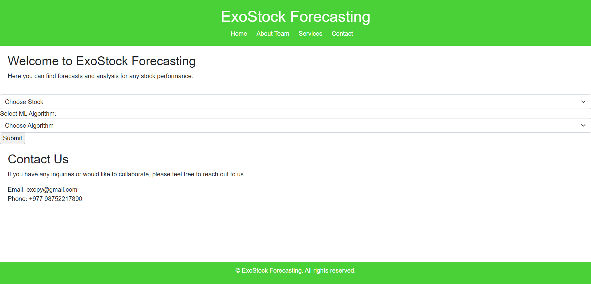
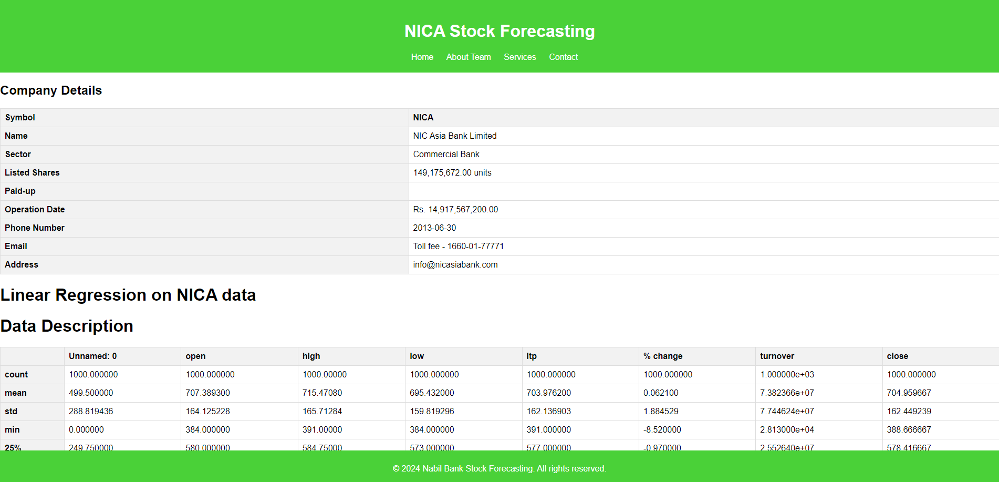
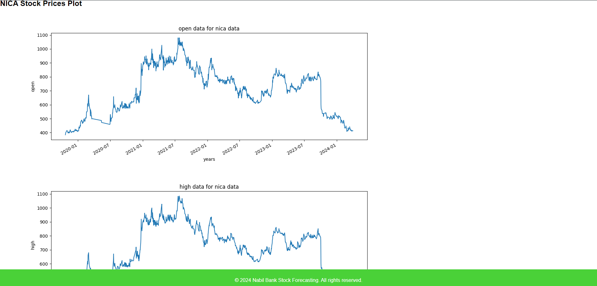
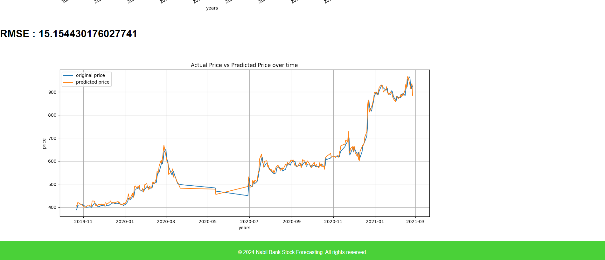
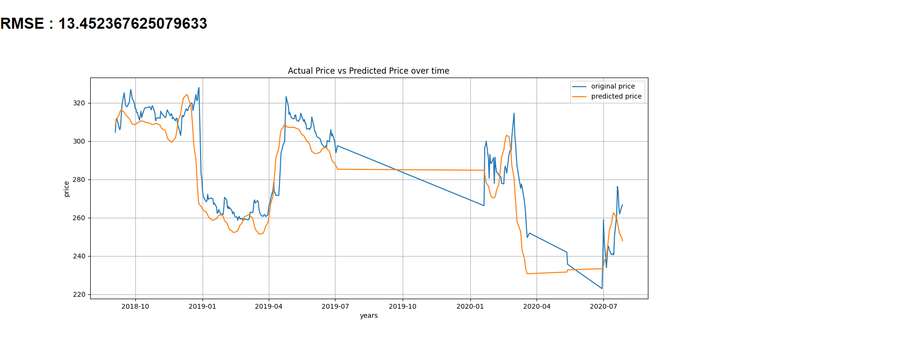

# ExoStock Time Series Forecasting

## Team Shibo

- [**Reezan Shrestha**](https://github.com/Shinigami-7)
- **Jyotsan Hamal** (myself)

## Project Snaps:
- Landing Page

- forecasted page:

- predicted

## Overview

The "ExoStock Time Series Forecasting" project aims to conduct a comprehensive analysis of historical stock data for Nepal top 30 Stock. Using time series analysis techniques, the project seeks to gain insights into the trends, patterns, and potential future performance of Nabil's stock.

## Project Goals

- Analyze historical stock data for Stocks. to understand past trends and patterns.
- Perform exploratory data analysis (EDA) to uncover key insights and characteristics of the stock data.
- Apply time series forecasting techniques to predict future stock prices.
- Evaluate the performance of the forecasting models and assess their accuracy and reliability.

## Key Components

1. **Data Collection**: Obtain historical stock price data of stock from reliable sources such as financial APIs or datasets.In our case we scrape the website [Share Shansar](www.sharesansar.com)
2. **Data Preprocessing**: Clean the raw data, handle missing values, and format the data into a suitable format for analysis.
3. **Exploratory Data Analysis (EDA)**: Explore the data through visualization and statistical analysis to identify trends, seasonality, and any anomalies.Facebook prophet will be used for Analysis
4. **Time Series Modeling**: Apply various time series modeling techniques such as ARIMA (AutoRegressive Integrated Moving Average), SARIMA (Seasonal ARIMA), or machine learning models like LSTM (Long Short-Term Memory) to forecast future stock prices.

   - **Traditional Time Series Forecasting Techniques:**
     - ARIMA
     - Prophet
     - Neural Prophet
     - Vector Autoregression
   - **Machine Learning:**
     - Neural Network Reressor
     - Catboost Regressor
     - Any regressor
5. **Model Evaluation**: Assess the performance of the forecasting models using metrics such as Mean Absolute Error (MAE), Mean Squared Error (MSE), and Root Mean Squared Error (RMSE). Compare the performance of different models to determine the most accurate one.
6. **Visualization**: Visualize the historical stock data, forecasted values, and model performance metrics using plots and graphs to communicate findings effectively.
7. **Documentation and Reporting**: Document the analysis process, methodologies, and findings in a comprehensive report or README.md file to provide clear insights and conclusions.

## Project Context

This project is part of our data science workshop facilitated by [**Kanchan Bhatt**](https://www.linkedin.com/in/itskanchanthings/), Data Scientist at [Alphateds Company](https://alphateds.com/).

## Technologies Used

- Python: Programming language for data analysis, modeling, and visualization.
- Pandas: Data manipulation and analysis library.
- NumPy: Numerical computing library for array operations and calculations.
- Matplotlib and Seaborn: Data visualization libraries for creating plots and graphs.
- Statsmodels: Library for time series analysis and modeling.
- Scikit-learn: Machine learning library for building predictive models.
- tensorflow: Deep learning library for building neural networks
- Jupyter Notebook: Interactive development environment for code execution, visualization, and documentation.

## Conclusion

The "ExoStock Time Series Forecasting" project aims to leverage advanced analytics techniques to gain valuable insights into the historical and future performance stock. By applying time series modeling and forecasting methods, the project seeks to assist investors, analysts, and stakeholders in making informed decisions regarding  stock investment in nepal.
